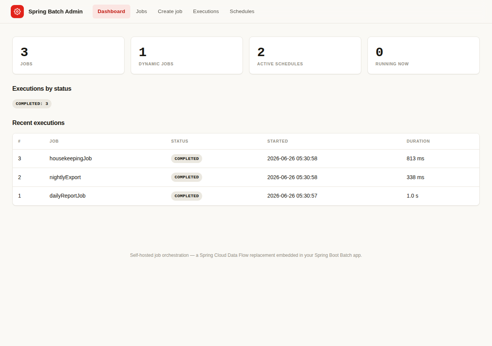
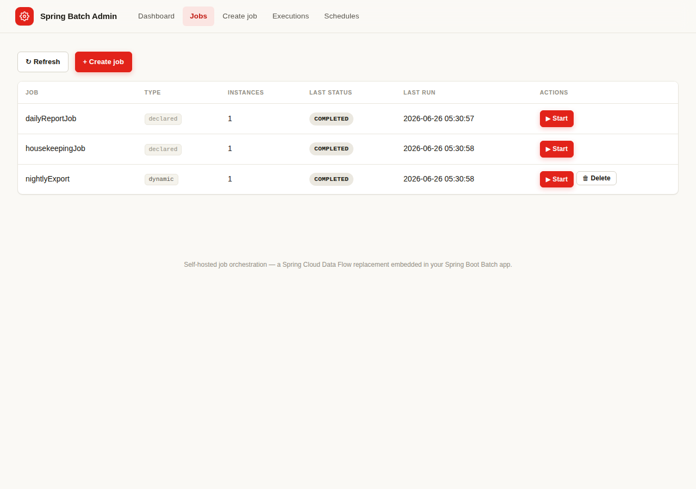
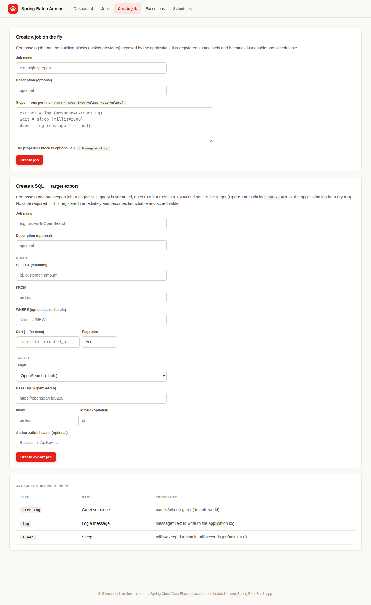
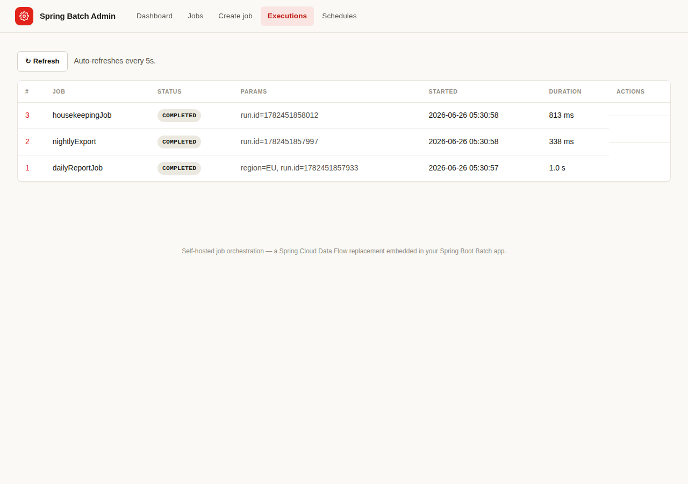
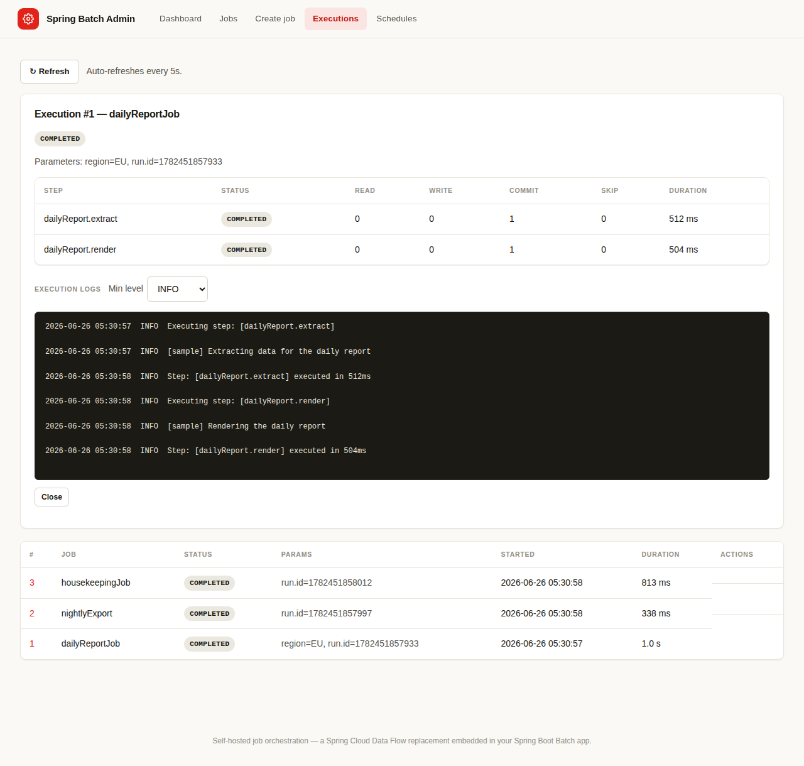
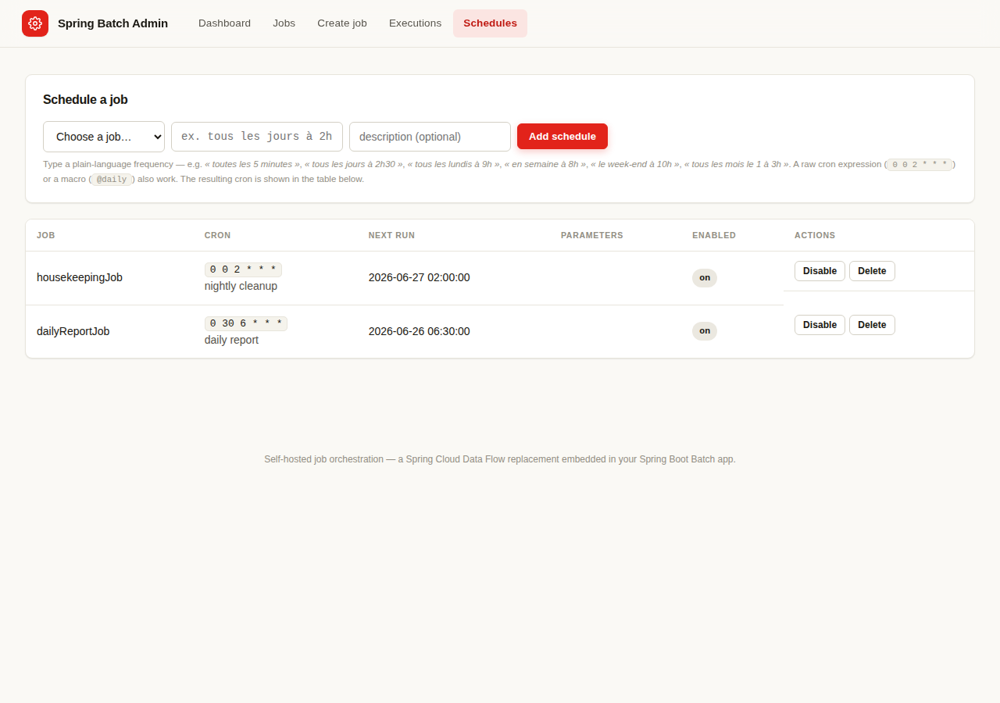

# Spring Boot Batch Admin

A **job-agnostic administration component** for Spring Batch jobs wrapped in Spring Boot. It
self-initializes when your application starts and exposes, on the application's own port and a
dedicated route, everything you need to operate your jobs:

- **create jobs on the fly** from reusable building blocks;
- **administer jobs from a browser GUI** — a **server-rendered Thymeleaf UI**, so the whole thing
  ships inside a single Spring Boot application with no separate front-end to build or deploy;
- **expose the full observability** required to run those jobs (REST + Micrometer metrics).

It is meant as a lightweight, embedded replacement for **Spring Cloud Data Flow** inside a single
Spring Boot Batch application.

See the **[CHANGELOG](CHANGELOG.md)** for the full list of features.

---

## Modules

| Module | Description |
| ------ | ----------- |
| `batch-admin-starter` | The auto-configured, reusable component: REST API, dynamic job engine, scheduler, observability, and the server-rendered Thymeleaf GUI. |
| `batch-admin-sample` | A runnable demo Spring Boot Batch application that includes the starter and declares a couple of jobs. |

---

## Quick start

```bash
mvn -q -DskipTests install
java -jar batch-admin-sample/target/spring-boot-batch-admin-sample-0.1.0-SNAPSHOT.jar
```

Open the GUI at **http://localhost:8080/batch-admin** and the REST API under
**http://localhost:8080/batch-admin/api**.

### Use it in your own app

Add the dependency to any Spring Boot Batch application:

```xml
<dependency>
    <groupId>io.batchadmin</groupId>
    <artifactId>spring-boot-batch-admin-starter</artifactId>
    <version>0.1.0-SNAPSHOT</version>
</dependency>
```

That is all. The component auto-configures itself as soon as Spring Batch, a `DataSource` and Spring
Web are on the classpath. It discovers your existing `Job` beans, registers them so they are
launchable, serves its Thymeleaf GUI, and never touches your application's own JPA/transaction
configuration (its own state is persisted through plain JDBC in two `BATCH_ADMIN_*` tables created
automatically). The GUI pulls in `spring-boot-starter-thymeleaf` transitively.

> **Migrating existing jobs?** See the **[Migration guide](docs/MIGRATION.md)** — a step-by-step
> walkthrough for onboarding your current Spring Batch jobs (discovery, launching, parameters,
> stop/restart, security, logs and scheduling), with a checklist and troubleshooting table.

---

## What it does

### 1. Administer existing jobs
Your jobs — declared as ordinary Spring beans — are discovered automatically. From the GUI or API you
can **start** them (asynchronously, so the call returns immediately), **stop** a running execution,
**restart** a failed/stopped one, **abandon**, and browse the full execution/step history.

### 2. Create jobs on the fly
Jobs can be composed at runtime from **building blocks**. A building block is a
`TaskletProvider` bean; the component ships generic ones (`log`, `sleep`, and an opt-in `command`)
and **your application contributes its own** simply by declaring a bean:

```java
@Component
public class ImportFileTaskletProvider implements TaskletProvider {
    public String getType() { return "import-file"; }
    public Tasklet create(Map<String, Object> properties) {
        return (contribution, chunkContext) -> { /* ... */ return RepeatStatus.FINISHED; };
    }
}
```

In the GUI's **Create job** screen you describe the steps, one per line:

```
extract = import-file (path=/in/data.csv)
wait    = sleep (millis=2000)
notify  = log (message=done)
```

Dynamically created jobs are **persisted** and re-registered on every restart.

Beyond tasklet building blocks, richer **chunk-oriented step types** can be contributed (the
`StepProvider` SPI). One ships out of the box: **`sql-export`** — a paged SQL query → JSON → target
(OpenSearch via its `_bulk` API, or the log for a dry run). The **Create job** screen has a dedicated
form for it, so operators can build a *SQL → OpenSearch export* job with no code; it is equally
available through the API:

```bash
curl -X POST http://localhost:8080/batch-admin/api/jobs -H 'Content-Type: application/json' -d '{
  "jobName":"ordersToOpenSearch",
  "steps":[{"name":"export","type":"sql-export","properties":{
    "select":"id, customer, amount", "from":"orders", "where":"status = '\''NEW'\''",
    "sort":"id", "pageSize":"500",
    "target":"opensearch", "baseUrl":"https://opensearch:9200", "index":"orders", "idField":"id"
  }}]}'
```

### 3. Schedule jobs
Any launchable job can be given a **schedule**. Schedules are persisted and re-armed on startup.
The frequency is entered in **plain language** (French or English) and converted to a Spring cron
expression server-side — for example:

| You type | Stored cron |
| -------- | ----------- |
| `toutes les 5 minutes` | `0 */5 * * * *` |
| `tous les jours à 2h30` | `0 30 2 * * *` |
| `tous les lundis à 9h` | `0 0 9 * * MON` |
| `en semaine à 8h` | `0 0 8 * * MON-FRI` |
| `le week-end à 10h` | `0 0 10 * * SAT,SUN` |
| `tous les mois le 1 à 3h` | `0 0 3 1 * *` |

A raw Spring cron expression (`second minute hour day-of-month month day-of-week`) or a macro
(`@daily`, `@hourly`, …) is still accepted as-is. The resulting cron and the next fire time are shown
in the schedules table. This conversion applies to both the GUI and the REST API.

### 4. Observe everything
The dashboard aggregates jobs, dynamic jobs, active schedules, currently running executions and a
status breakdown, plus a live feed (auto-refreshing) of recent executions with per-step
read/write/commit/skip counters. Job timing is additionally published to **Micrometer**
(`spring.batch.job` timers, plus `batch.admin.executions.running` and `batch.admin.schedules.active`
gauges), available through Spring Boot Actuator.

### 5. Read execution logs
Every log line emitted while a job runs is captured and attributed to that execution (via an MDC key
set by a job listener and a Logback appender), then exposed per execution. The **execution detail**
screen shows the captured logs with a **configurable minimum level** selector, and the API returns
them filtered by level:

```
GET /batch-admin/api/executions/{id}/logs?level=WARN&limit=1000
```

Capture is bounded in memory (most recent records per execution, oldest executions evicted) so it
never grows unbounded. The capture threshold, default read level and buffer sizes are configurable
(see below). Logs below the application's effective logger level are never emitted, so to capture
`DEBUG` you must also lower the relevant logger level. Requires Logback (the Spring Boot default).

---

## Reusable building blocks

### Generic SQL reader
A configurable Spring Batch `ItemReader` that streams the rows of an arbitrary SQL query is shipped
for use in your chunk-oriented steps — read each row as a `Map<String, Object>` with no mapping code,
or map to your own type:

```java
// Rows as maps (column label -> value):
GenericSqlItemReader<Map<String, Object>> reader = GenericSqlItemReaderBuilder.mapRows()
        .name("ordersReader")
        .dataSource(dataSource)
        .sql("SELECT id, customer, amount FROM orders WHERE status = ?")
        .parameters("NEW")
        .fetchSize(500)
        .build();

// Or map to a type:
GenericSqlItemReader<String> names = GenericSqlItemReaderBuilder
        .mapWith((rs, rowNum) -> rs.getString("name"))
        .name("names").dataSource(dataSource).sql("SELECT name FROM person ORDER BY id")
        .build();
```

It is cursor-based (streams rows, low memory) and restartable: the query must impose a stable
`ORDER BY` for restarts to skip already-processed rows correctly. `fetchSize`, `maxRows`,
`queryTimeout` and `saveState` are configurable.

### Paged SQL reader
For very large result sets or restart-critical jobs, a **paged** reader queries one page at a time
(so restart resumes cleanly at the next page). Describe the query in parts plus a sort key:

```java
GenericSqlPagingItemReader<Map<String, Object>> reader = GenericSqlPagingItemReaderBuilder.mapRows()
        .name("ordersReader")
        .dataSource(dataSource)
        .select("id, customer, amount")
        .from("orders")
        .where("status = :status")
        .parameter("status", "NEW")
        .sortAsc("id")
        .pageSize(500)
        .build();
```

### JSON processor and a generic writer (e.g. OpenSearch)
Together these form a **SQL → JSON → target** pipeline. `JsonItemProcessor` serializes each item to
JSON; `GenericJsonItemWriter` writes the JSON to a pluggable `JsonDocumentSink`. A bundled
`OpenSearchBulkJsonSink` indexes the documents into OpenSearch/Elasticsearch via the `_bulk` REST
API using only the JDK HTTP client (no extra dependency); `LoggingJsonDocumentSink` is a dry-run
target:

```java
Step exportToOpenSearch = new StepBuilder("export", jobRepository)
        .<Map<String, Object>, String>chunk(500, transactionManager)
        .reader(GenericSqlPagingItemReaderBuilder.mapRows()
                .name("orders").dataSource(dataSource)
                .select("*").from("orders").sortAsc("id").build())
        .processor(new JsonItemProcessor<Map<String, Object>>())
        .writer(new GenericJsonItemWriter(
                OpenSearchBulkJsonSink.builder()
                        .baseUrl("https://opensearch:9200")
                        .index("orders")
                        .header("Authorization", "Basic …")
                        .idField("id")          // optional: use a JSON field as the document _id
                        .build()))
        .build();
```

Each chunk is sent as a single bulk request; non-2xx responses and per-document errors fail the
step. Supply your own `HttpClient` (via `.httpClient(...)`) for custom TLS/proxy/auth. Implement
`JsonDocumentSink` to target anything else (a file, a queue, another HTTP API).

---

## GUI routes

The browser GUI is served under `${batch.admin.base-path}` (default `/batch-admin`):

| Path | Screen |
| ---- | ------ |
| `/batch-admin` | Dashboard |
| `/batch-admin/jobs` | Jobs list, start & delete |
| `/batch-admin/jobs/new` | Create a job on the fly |
| `/batch-admin/executions` | Executions, step detail & captured logs |
| `/batch-admin/schedules` | Cron schedules |

All actions are plain HTML form POSTs that redirect back (Post/Redirect/Get) — no client-side
framework or JavaScript build is involved.

---

## REST API

The same capabilities are available as a JSON API under `${batch.admin.base-path}/api`
(default `/batch-admin/api`), useful for automation:

| Method & path | Purpose |
| ------------- | ------- |
| `GET /jobs` · `GET /jobs/{name}` | List / detail |
| `GET /jobs/providers` | Available building blocks |
| `POST /jobs` · `DELETE /jobs/{name}` | Create / delete a dynamic job |
| `POST /jobs/{name}/executions` | Start a job (async) |
| `GET /jobs/{name}/executions` | Execution history of a job |
| `GET /executions?limit=` · `GET /executions/{id}` | Recent / detail with steps |
| `GET /executions/{id}/logs?level=&limit=` · `GET /log-levels` | Captured execution logs / level list |
| `POST /executions/{id}/stop` · `/restart` · `/abandon` | Control an execution |
| `GET /schedules` · `POST /schedules` · `PUT /schedules/{id}/enabled?value=` · `DELETE /schedules/{id}` | Manage schedules |
| `GET /observability/summary` | Dashboard snapshot |

---

## Configuration

All properties are optional and prefixed with `batch.admin`:

```yaml
batch:
  admin:
    enabled: true                 # master switch
    base-path: /batch-admin       # route for the GUI and (with /api) the REST API
    ui-enabled: true              # serve the Thymeleaf GUI
    scheduling:
      enabled: true
      pool-size: 4
    dynamic-jobs:
      enabled: true
      allow-command-tasklets: false   # enable the OS-command building block (trusted envs only)
    observability:
      recent-executions-limit: 100
      metrics-enabled: true
    logs:
      enabled: true
      capture-level: INFO          # minimum level captured per execution
      default-read-level: INFO     # default minimum level when reading logs
      max-records-per-execution: 2000
      max-executions: 200          # executions kept in the in-memory log buffer
```

---

## Screenshots

The server-rendered GUI (captured with `scripts/take-screenshots.sh`):

| | |
| --- | --- |
| **Dashboard** | **Jobs** |
|  |  |
| **Create job** | **Executions** |
|  |  |
| **Execution detail & logs** | **Schedules** |
|  |  |

Regenerate them at any time (builds the app, starts it, smoke-tests every page, seeds demo data,
captures all screens with headless Chromium, then stops the app):

```bash
scripts/take-screenshots.sh
```

---

## Development in Claude Code on the web

A `SessionStart` hook (`.claude/hooks/session-start.sh`, registered in `.claude/settings.json`)
prepares remote web sessions so tests and screenshots work immediately. It:

1. warms the Maven dependency cache and builds the modules (`mvn -DskipTests install`), so
   `mvn test` runs fast and offline;
2. installs Playwright and reuses the environment's pre-installed Chromium (falling back to a
   download only if needed) for `scripts/take-screenshots.sh`.

The hook runs **synchronously** (the session starts once setup is complete) and only in the remote
environment. Once it is on your default branch, every future web session uses it.

---

## Requirements

- Java 21+
- A relational `DataSource` (the component creates its two tables with `CREATE TABLE IF NOT EXISTS`;
  H2 and PostgreSQL are supported out of the box)
